# Manual de Usuario - Gestión de Gastos

La aplicación de **Gestión de Gastos**. Este sistema te permite llevar un control detallado de tus finanzas personales y compartir gastos en grupos de manera sencilla e intuitiva.

---

## 1. Pantalla Principal

Al iniciar la aplicación, accederás a la **Ventana Principal**, el centro de control de tu economía.

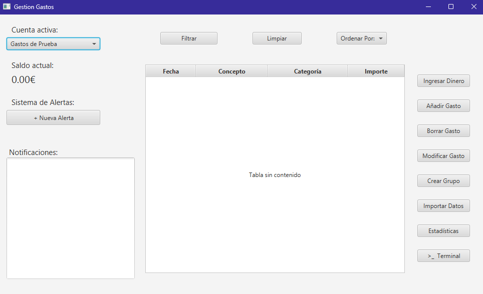

### Elementos de la Interfaz:
* **Selector de Cuenta (Arriba Izquierda):** Un menú desplegable donde eliges qué cuenta quieres visualizar. Por defecto aparecerá tu *Cuenta Personal*, pero aquí también aparecerán los *Grupos* que crees.
* **Saldo Actual:** Justo debajo del selector, verás el dinero total disponible en la cuenta seleccionada.
* **Tabla de Movimientos (Centro):** Muestra el historial de operaciones con las columnas:
    * *Fecha*
    * *Concepto*
    * *Categoría*
    * *Importe*
* **Panel de Acciones (Derecha):** Botones para realizar operaciones (Ingresar, Añadir Gasto, Modificar, etc.).
* **Sistema de Alertas (Izquierda):** Muestra notificaciones si superas tus límites de gasto.

---

## 2. Gestión de Movimientos

### Ingresar Dinero
Para añadir saldo a tu cuenta:
1.  Selecciona la cuenta deseada.
2.  Pulsa el botón **"Ingresar Dinero"**.
3.  Escribe la cantidad en la ventana emergente y pulsa Aceptar.
    > **Nota:** Si ingresas dinero en un Grupo, el sistema asignará ese ingreso a tu participación dentro del grupo.

### Registrar un Gasto

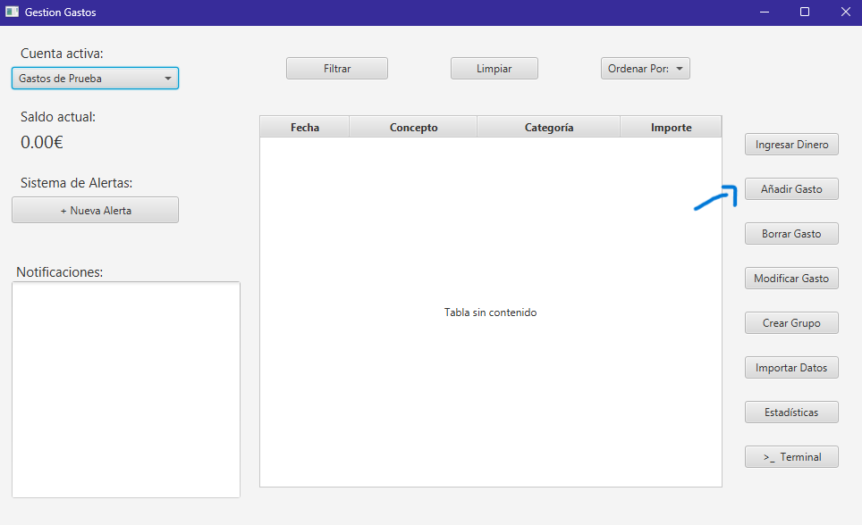

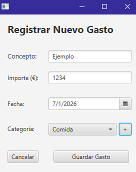
1.  Pulsa el botón **"Añadir Gasto"**.
2.  Rellena el formulario:
    * **Concepto:** Descripción del gasto (ej. "Compra semanal").
    * **Importe:** Coste del gasto.
    * **Fecha:** Selecciona el día en el calendario.
    * **Categoría:** Elige una del listado.
        * Si no existe la categoría pulsa el botón **`+`** al lado del desplegable para crearla al instante.
3.  **Para Cuentas Compartidas:** Deberás seleccionar en la lista inferior **quién ha pagado** ese gasto.
4.  Pulsa **"Guardar Gasto"**.

### Modificar un Gasto

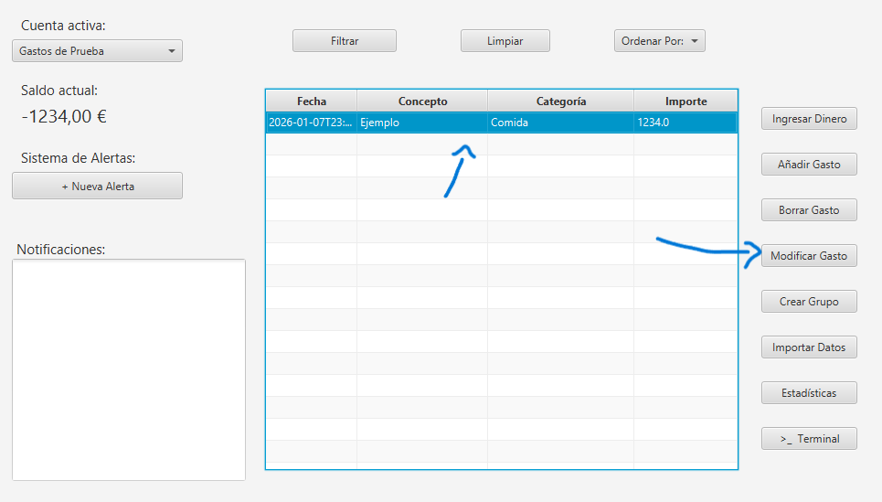

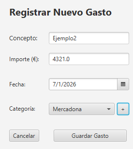
Si te has equivocado al introducir un dato:
1.  Haz clic sobre el gasto en la tabla para seleccionarlo (se pondrá azul).
2.  Pulsa el botón **"Modificar"**.
3.  Cambia los datos necesarios (puedes dejar igual los que no quieras cambiar).
4.  Pulsa **Guardar**. El saldo se recalculará automáticamente corrigiendo la diferencia.

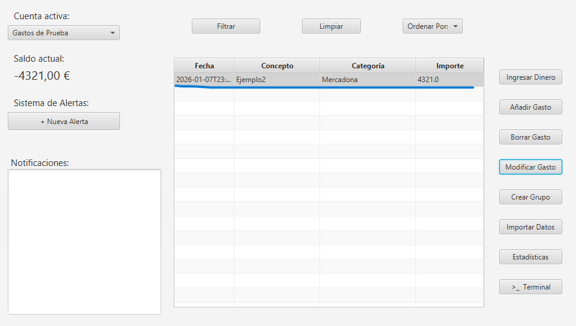

### Eliminar un Gasto

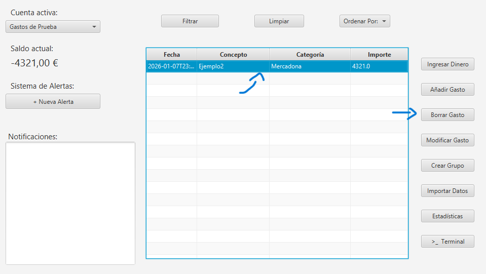

1.  Selecciona el gasto en la tabla.
2.  Pulsa el botón **"Eliminar"**.
3.  Confirma la acción. El importe del gasto será devuelto al saldo de la cuenta.

---

## 3. Grupos y Cuentas Compartidas

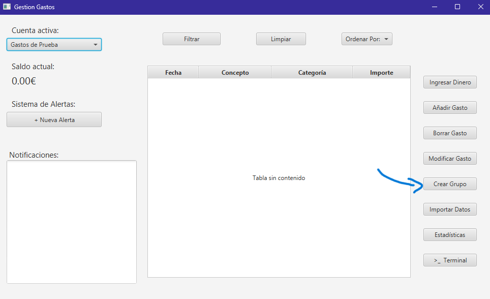

### Crear un Grupo
1.  Pulsa el botón **"Crear Grupo"**.
2.  Escribe un **Nombre** para el grupo (ej. "Viaje a París").
3.  Añade los **Participantes**:
    * Escribe el nombre y pulsa "Añadir".
    * *(Opcional)* Define un porcentaje de participación si los gastos no se dividen a partes iguales.
4.  Pulsa **"Crear Grupo"**.

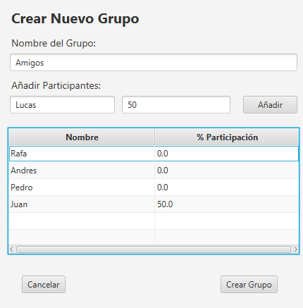

5.  Ahora podrás seleccionarlo en el **Selector de Cuenta** de la pantalla principal.

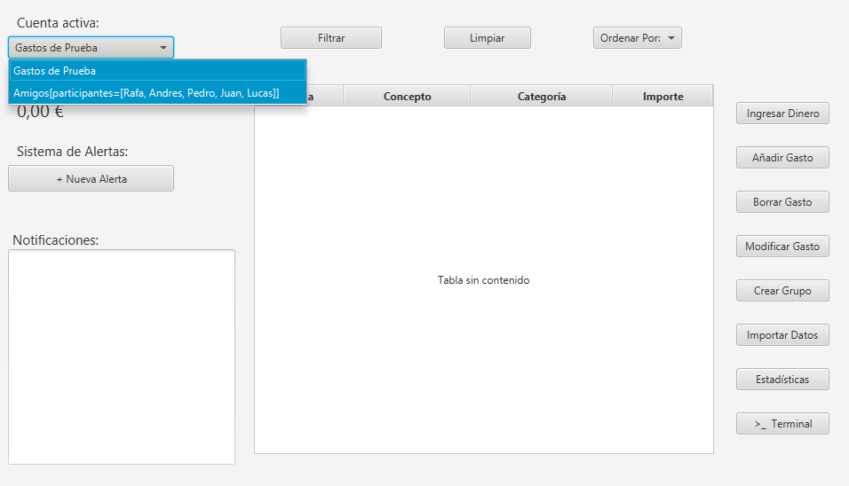

---

## 4. Herramientas de Análisis

### Filtros Avanzados

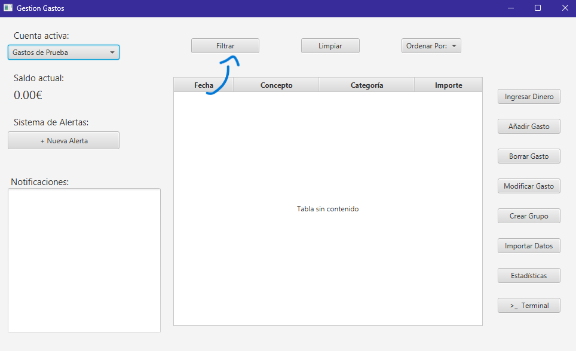

Encuentra movimientos específicos rápidamente:
1.  Pulsa el botón **"Filtrar"** (arriba al centro).
2.  Establece tus criterios:
    * Rango de Fechas (Desde/Hasta).
    * Categoría específica.
    * Rango de precios (Mín/Máx).
3.  Pulsa **"Aplicar Filtros"**.
4.  Para volver a ver todo, pulsa **"Limpiar"** en la ventana principal.

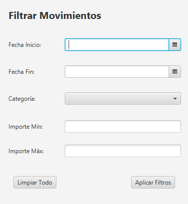

### Estadísticas Visuales
**No Implementado**

### Importación de Datos

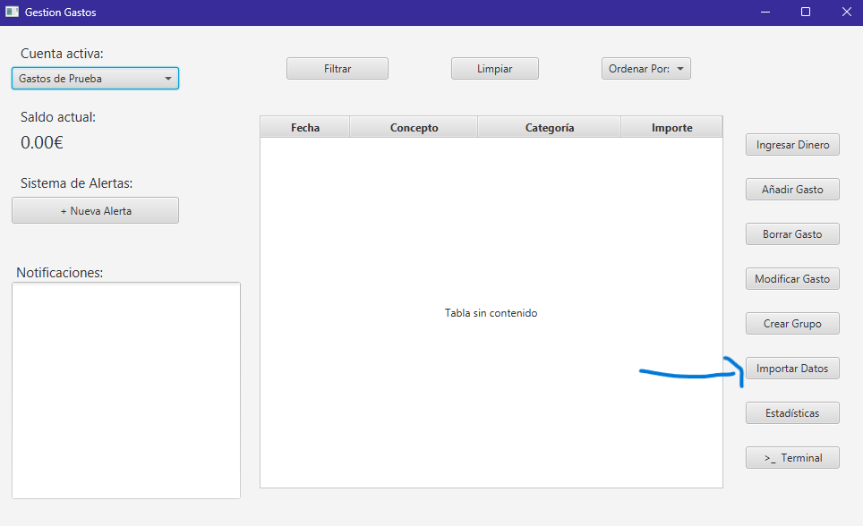

Carga gastos masivamente desde archivos externos:
1.  Pulsa **"Importar Datos"**.
2.  Selecciona un archivo `.csv` o `.json` en tu ordenador.
3.  El sistema procesará los gastos y los asignará a las cuentas correspondientes automáticamente.

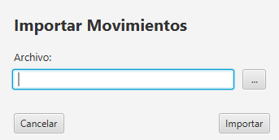

### Alertas de Gasto

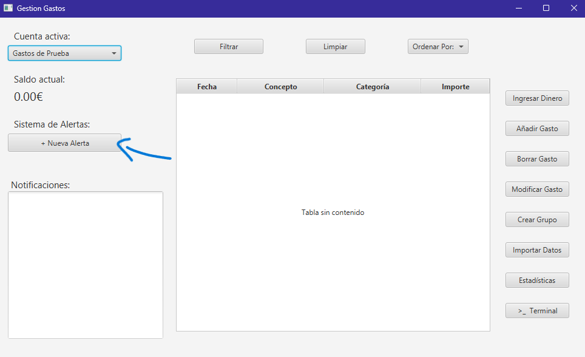

Configura avisos para controlar gastos:
1.  Pulsa **"+ Nueva Alerta"**.

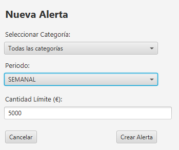

2.  Elige el periodo (Semanal/Mensual), la categoría a vigilar y el límite de dinero.
3.  Si un gasto futuro supera ese límite, recibirás un aviso en el panel de **Notificaciones**.

---

## 5. Modo Terminal (Consola)

Para usuarios avanzados, la aplicación permite gestionar gastos mediante comandos de texto sin dejar de usar la interfaz gráfica.

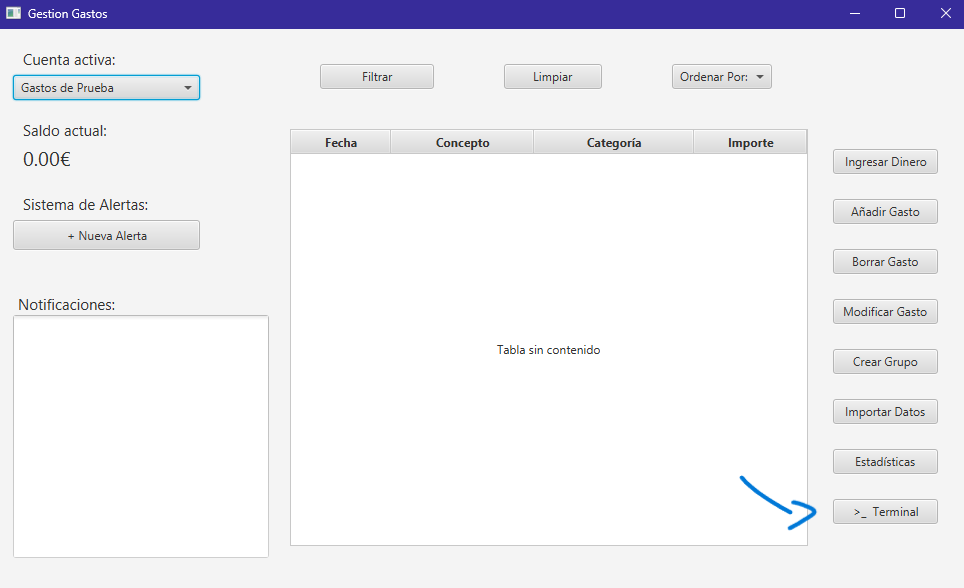

### Cómo usarlo:
1.  En la ventana principal, pulsa el botón **">_ Terminal"**.
2.  **¡Importante!** Dirígete a la consola de tu entorno de trabajo.
3.  Escribe comandos para controlar gastos con la cuenta activa.

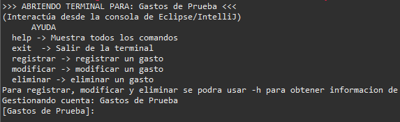

### Comandos Disponibles:
* `help`: Muestra la lista de comandos.
* `registrar`: Inicia un asistente paso a paso para añadir un gasto.
* `modificar`: Muestra una lista numerada para editar un gasto existente.
* `eliminar`: Solicita el número del gasto a borrar.
* `exit`: Cierra el modo terminal y actualiza la ventana gráfica.