# Manual de Usuario - Gestión de Gastos

La aplicación de **Gestión de Gastos** permite registrar gastos personales, organizar gastos compartidos, consultar movimientos, aplicar filtros, visualizar estadísticas, configurar alertas e importar gastos desde ficheros externos.

---

## 1. Pantalla Principal

Al iniciar la aplicación se muestra la ventana principal.

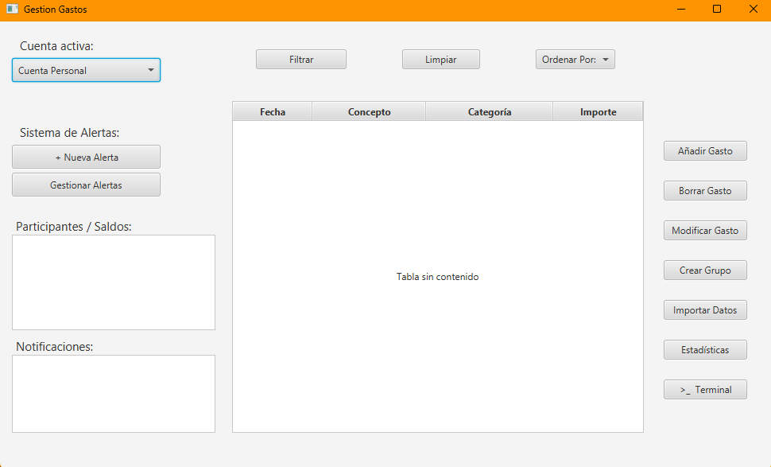

### Elementos principales:
- **Selector de cuenta:** menú desplegable que permite elegir entre la cuenta personal y las cuentas compartidas creadas.
- **Tabla de Movimientos:** muestra fecha, concepto, categoría e importe de los gastos de la cuenta activa.
- **Panel de Acciones:** contiene botones para añadir, modificar, eliminar, crear grupos, filtrar, ver estadísticas, importar datos, gestionar alertas y abrir la terminal.
- **Panel de notificaciones:** muestra avisos generados cuando se supera una alerta configurada.
- **Panel de saldos compartidos:** cuando se selecciona una cuenta compartida, muestra el saldo pendiente de cada participante.

---

## 2. Gestión de Movimientos

### Registrar un Gasto

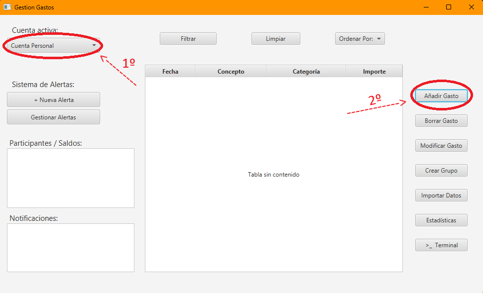

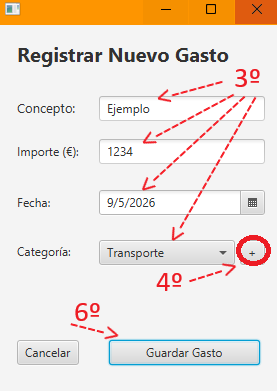

1. Selecciona la cuenta en la que quieres registrar el gasto
2. Pulsa el botón **"Añadir Gasto"**.
3. Rellena el formulario:
    * **Concepto:** descripción del gasto (ej. "Compra semanal").
    * **Importe:** cantidad del gasto.
    * **Fecha:** día en el que se realizó
    * **Categoría:** categoría asociada.
4. Si la categoría no existe, pulsa el botón **+** para crearla.
5. Si la cuenta es compartida, selecciona el participante que ha pagado.
6. Pulsa **Guardar Gasto**

### Modificar un Gasto

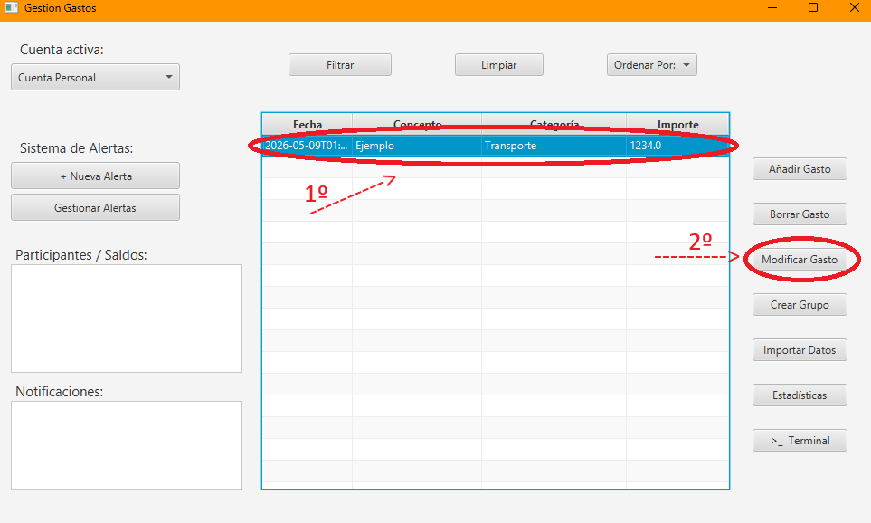

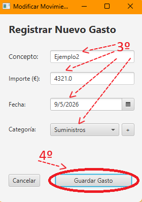

1. Selecciona un gasto en la tabla
2. Pulsa el botón **"Modificar"**.
3. Cambia los campos necesarios
4. Pulsa **Guardar**. 
5. La tabla se actualiza, y si es una cuenta compartida, también se actualizan los saldos de los participantes.

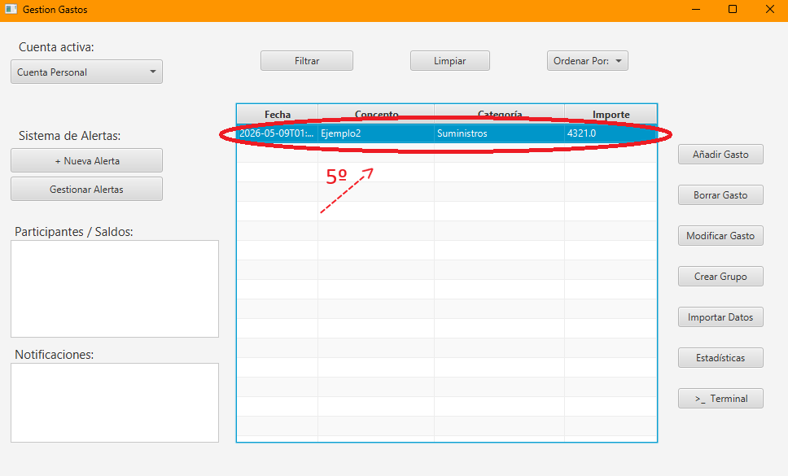

### Eliminar un Gasto

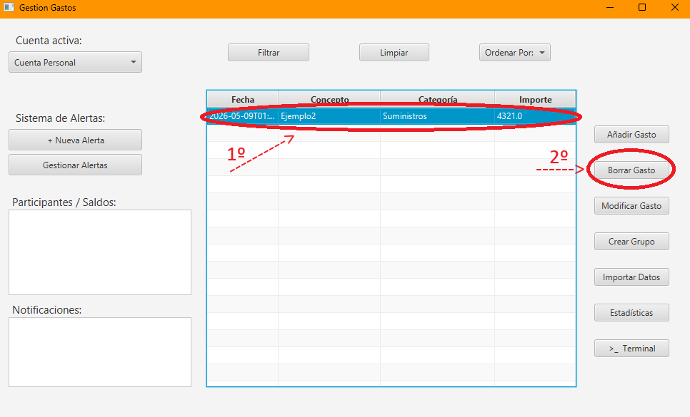

1. Selecciona el gasto en la tabla.
2. Pulsa el botón **"Eliminar"**.
3. El movimiento se elimina de la cuenta seleccionada y se actualiza la tabla.

---

## 3. Grupos y Cuentas Compartidas

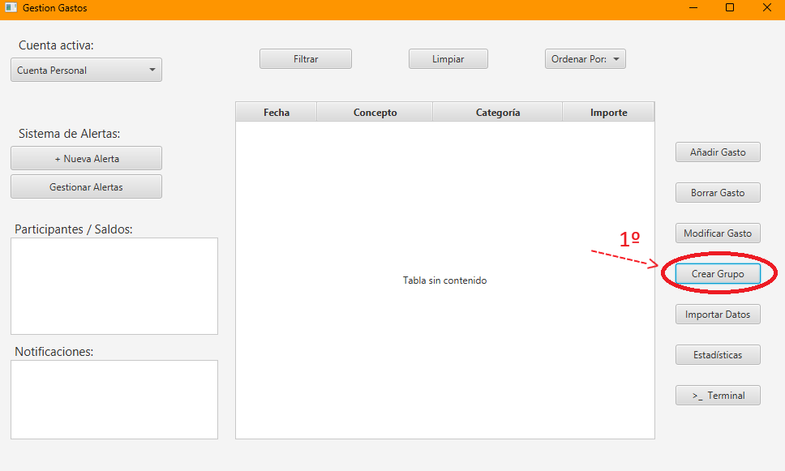

### Crear una cuenta compartida

1. Pulsa el botón **"Crear Grupo"**.
2. Introduce un nombre para la cuenta compartida.
3. Añade los participantes.
4. Opcionalmente indica un porcentaje de participación para cada persona.
5. Si no se introducen porcentajes, el sistema realiza un reparto equitativo.
6. Si se introducen porcentajes, la suma debe ser 100%
7. Pulsa **Crear Grupo**

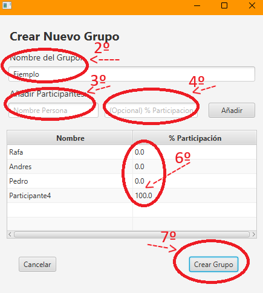

La cuenta aparecerá en el selector de cuentas.

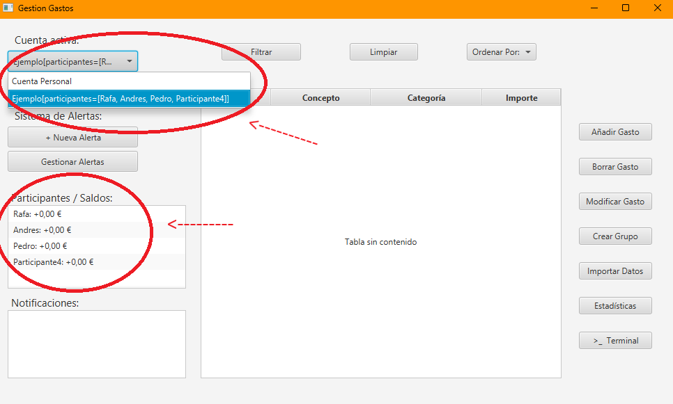

En una cuenta compartida, cada gasto debe tener un pagador. El sistema calcula automáticamente el sado de cada participante:
- Saldo positivo: al participante le deben dinero.
- Saldo negativo: el participante debe dinero al grupo.

---

## 4. Filtros y análisis

### Filtros Avanzados

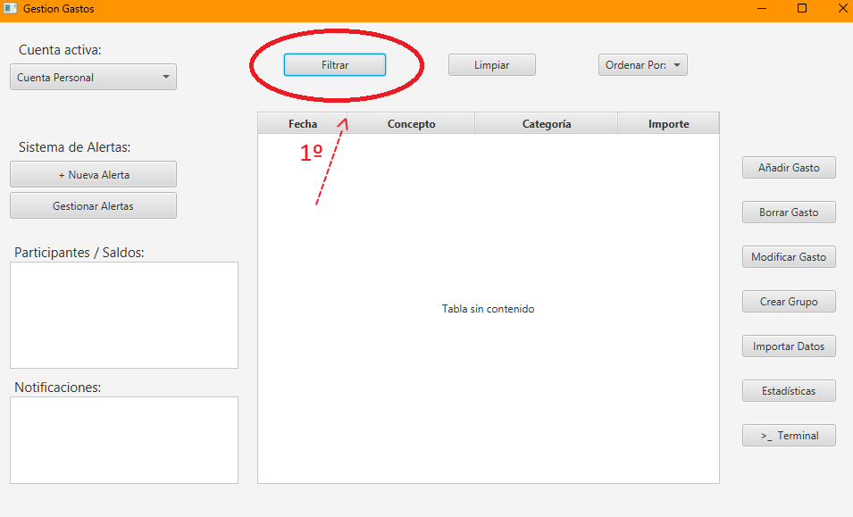

1. Pulsa el botón **"Filtrar"**.
2. Establece tus criterios:
    - intervalo de fechas
    - uno o varios meses
    - una o varias categorías
    - importe mínimo y máximo
3. Pulsa **"Aplicar Filtros"**.
4. La tabla mostrará únicamente los movimientos que cumplan todos los criterios seleccionados.
5. Para volver a ver todos los movimientos, pulsa **Limpiar** en la ventana principal o limpia los campos desde la ventana de filtros.

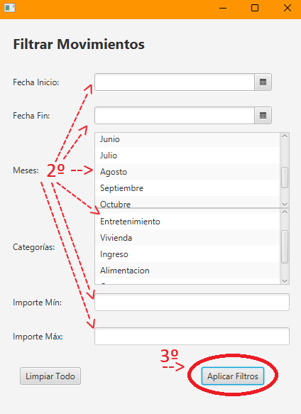

Si no se seleccionan meses o categorías, el sistema interpreta que no se aplica ese filtro concreto.

### Estadísticas Visuales

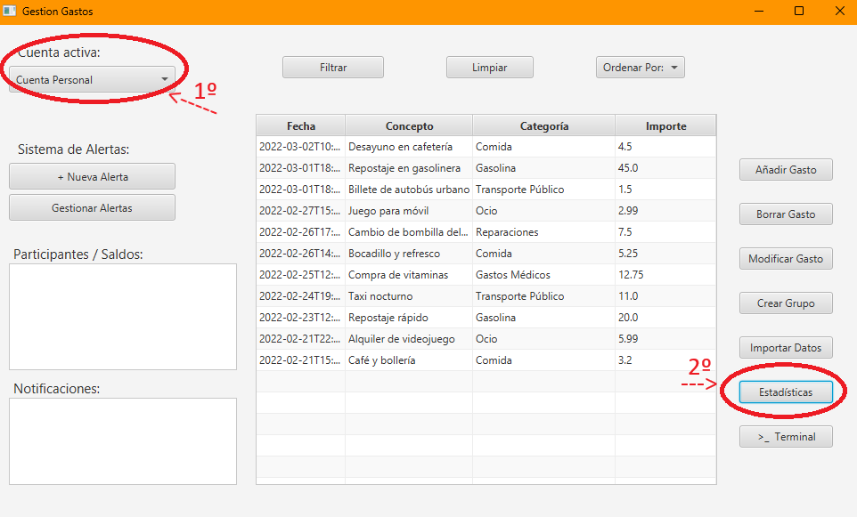

1. Selecciona una cuenta.
2. Pulsa **Estadísticas**.
3. Se abrirá una ventana con la representación gráfica de los gastos por categoría

Las estadísticas se pueden observar como diagrama de barras:

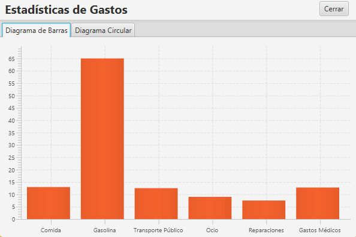

O también como diagrama circular:

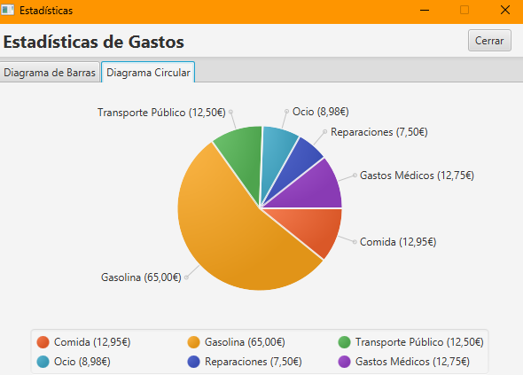

## 5. Importación de Datos

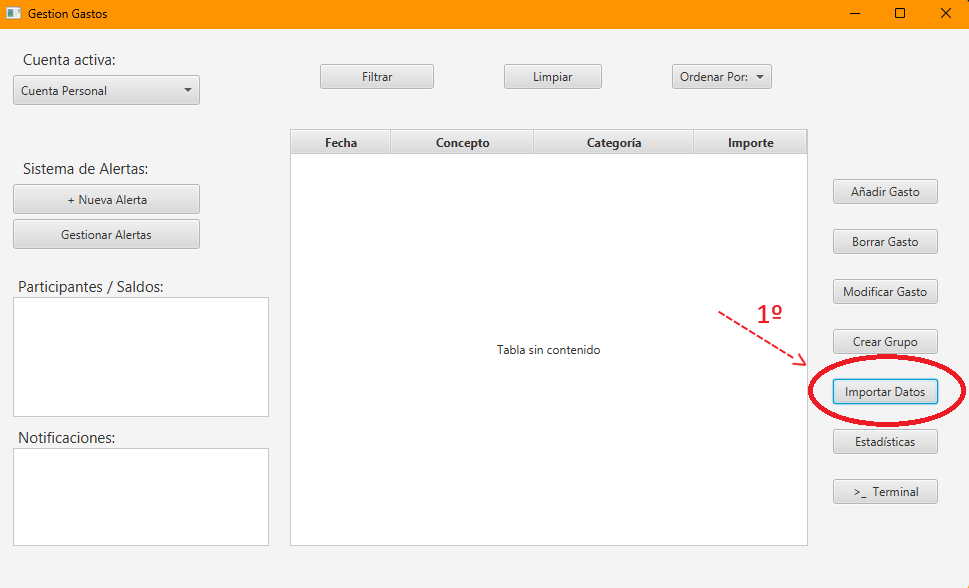

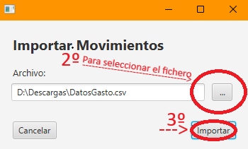

1. Pulsa **"Importar Datos"**.
2. Selecciona un archivo `.csv` o `.txt`.
3. Pulsa **Importar**
4. El sistema procesará los movimientos y los registrará en las cuentas correspondientes.

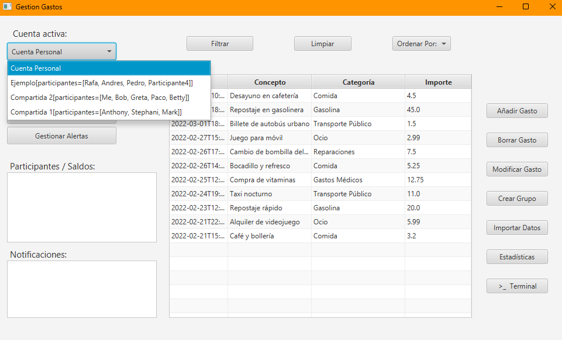

### Formatos soportados

Formato CSV: Date,Account,Category,Subcategory,Note,Payer,Amount,Currency

Formato TXT: Date;Account;Category;Subcategory;Note;Payer;Amount;Currency

En ambos formatos:
- `Date` indica la fecha.
- `Account` indica la cuenta destino.
- `Subcategory` se usa como categoría interna del gasto.
- `Note` se usa como concepto.
- `Payer` se usa como pagador en cuentas compartidas.
- `Amount` indica el importe.
- `Currency` se conserva como información externa del formato, pero la aplicación trabaja con importes en euros.

### 6. Alertas de Gasto

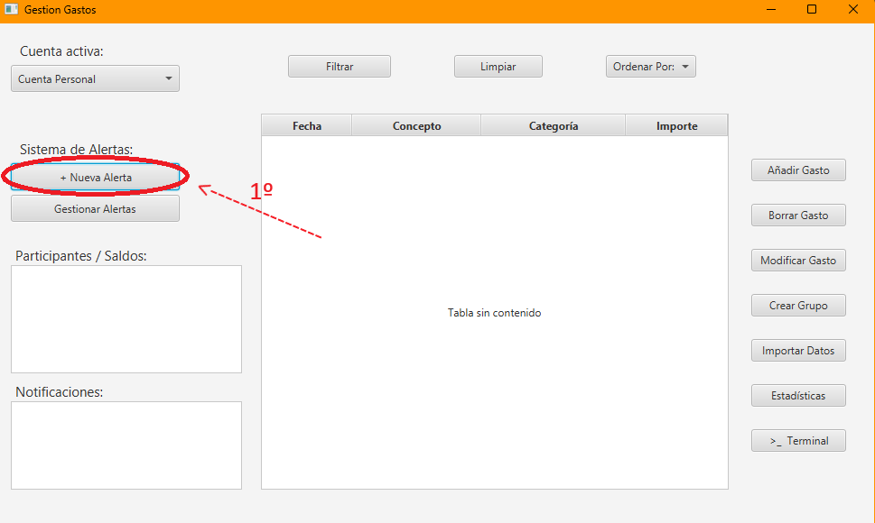

1. Pulsa **+ Nueva Alerta**.
2. Elige el periodo: semanal o mensual
3. Indica el límite de gasto
4. Opcionalmente selecciona una categoría
5. Guarda la alerta

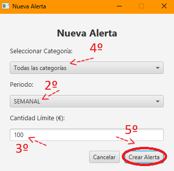

Cuando un nuevo gasto hace que se supere el límite configurado, el sistema genera una notificación visible en la ventana principal.

### Modificar o eliminar alerta

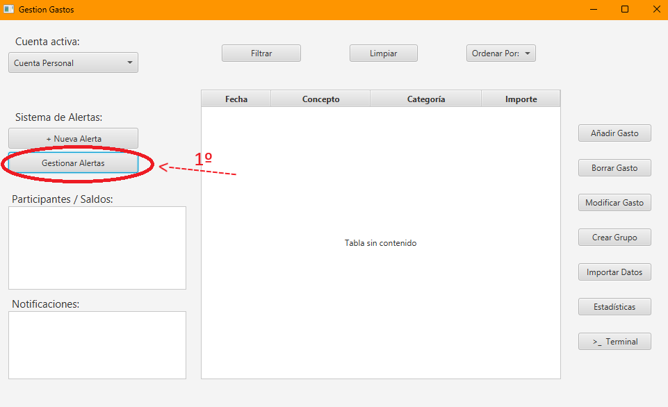

1. Pulsa **Gestionar Alertas**
2. Elige la alerta que quieres modificar o eliminar
3. Pulsa **Eliminar** o **Modificar** según tu intención

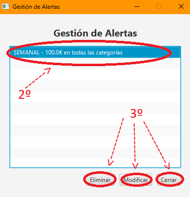

---

## 7. Modo Terminal (Consola)

La aplicación incluye una terminal básica para gestionar gastos mediante comandos.

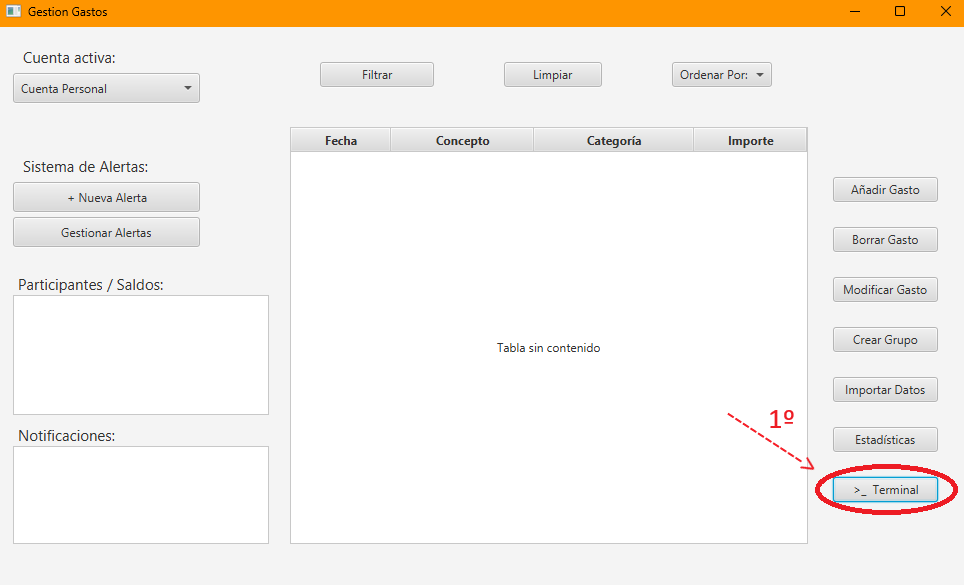

### Cómo usarlo:

1. Selecciona una cuenta en la ventana principal.
2. Pulsa **>_ Terminal**.
3. Dirígete a la consola del entorno de ejecución.
4. Introduce comandos para operar sobre la cuenta activa

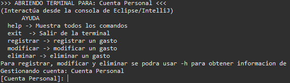

### Comandos disponibles
- `help`: muestra la lista de comandos.
- `registrar`: inicia el asistente para añadir un gasto.
- `modificar`: permite editar un gasto existente.
- `eliminar`: permite borrar un gasto.
- `exit`: cierra el modo terminal y actualiza la ventana gráfica.

## 8. Persistencia

Los datos se guardan automáticamente en formaso JSON mediante Jackson. Al cerrar y volver a abrir la aplicación, se recuperan las cuentas, movimientos, alertas y notificaciones persistidas.