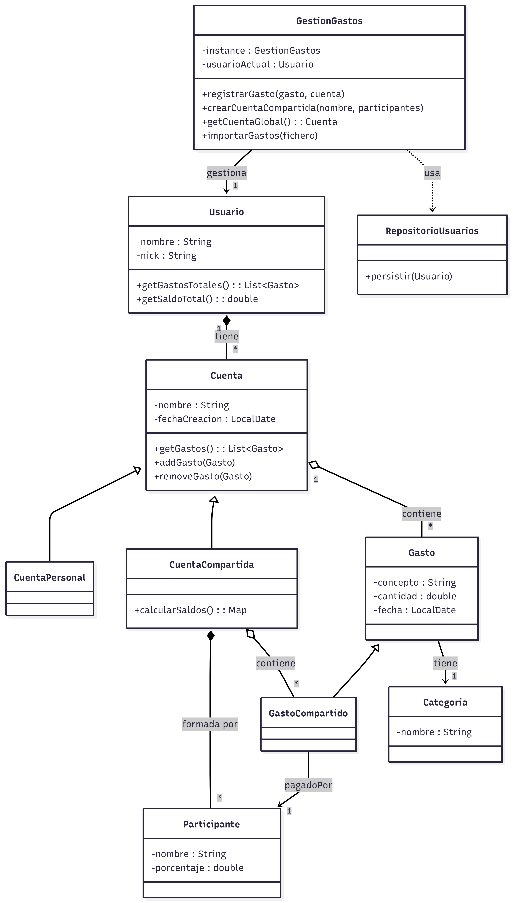

##1.  Diagrama de clases del dominio del proyecto.

   

##3.  Especificación de las historias de usuario del proyecto.

##4.  Un diagrama de interacción para la una de las historias de usuario (a elección del grupo)

##5.  Breve explicación de la arquitectura de la aplicación y decisiones de diseño que se consideren de interés para la comprensión del trabajo.

##6.  Explicación de los patrones de diseño usados.

##7.  Breve manual de usuario (debe incluir capturas de las ventanas para apoyar las explicaciones)
