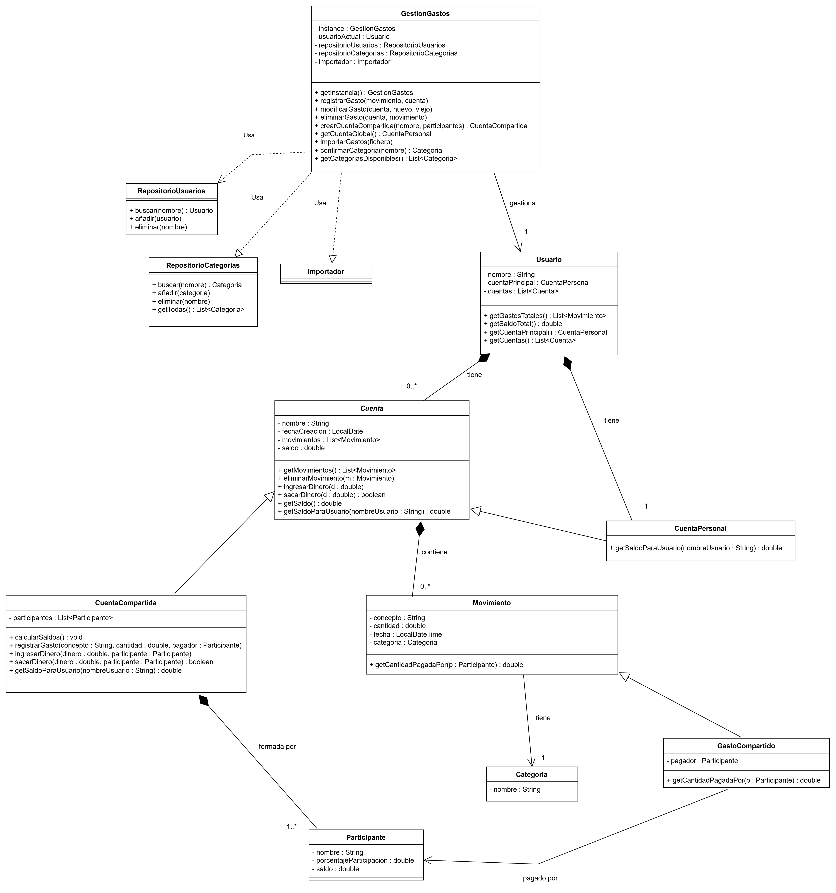

# <ins> **DOCUMENTACION**</ins>

## Diagrama de clases del dominio.

En nuestro programa se utilizará el controlador **GestionGastos** para gestionar de forma correcta la aplicación y sus datos. Este contendrá al usuario actual y ofrecerá las funciones principales del programa, como registrar, modificar y eliminar movimientos, así como crear cuentas compartidas. También utilizará un importador, capaz de importar gastos desde un archivo. Para la correcta organización y gestión de la información se utilizarán repositorios tanto para los usuarios como para las categorías.

La clase **Usuario** contendrá la información del usuario. Tendrá su nombre, la información de su cuenta personal y una lista de cuentas a las que pertenece, pudiendo ser estas tanto personales como compartidas. Esta clase permitirá obtener los gastos y el saldo de las cuentas.

**Cuenta** es la clase abstracta usada en este programa para representar los datos de la cuenta del usuario, como el nombre, la fecha de creación, los movimientos y el saldo. Contendrá funciones para ingresar o retirar dinero y para consultar el saldo. Las clases **CuentaPersonal** y **CuentaCompartida** son clases heredadas de **Cuenta** y representan cuentas individuales y cuentas con varios participantes, respectivamente. Esta última estará compuesta por más de un **Participante**, los cuales, según el reparto de gastos, pagarán un porcentaje de cada pago.

Todas las clases **Cuenta** contienen una colección de **Movimiento**. Estos representan un gasto o un ingreso y poseen los atributos concepto, cantidad, fecha y categoría. Las **Categoría** sirven para clasificar los movimientos y facilitar su análisis. En las cuentas compartidas, se pueden tener movimientos de tipo **GastoCompartido**, que además de los datos anteriores indican qué **Participante** ha realizado el pago. Esto es lo que permite realizar los cálculos de cuánto se debe a cada participante o cuánto debe cada participante dentro de la cuenta.

# 3.  Un diagrama de interacción para la una de las historias de usuario (a elección del grupo)

## Diagrama de interacción para Registrar Gasto.

# 4.  Breve explicación de la arquitectura de la aplicación y decisiones de diseño que se consideren de interés para la comprensión del trabajo.

# 5.  Explicación de los patrones de diseño usados.

# 6.  Breve manual de usuario (debe incluir capturas de las ventanas para apoyar las explicaciones)
