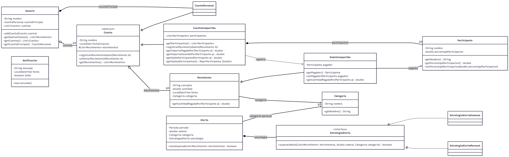

# <ins> **DOCUMENTACION**</ins>
Esta documentación describe el diseño y funcionamiento de la aplicación de gestión de gastos, incluyendo el modelo de dominio, la arquitectura, las decisiones de diseño y los patrones utilizados.

## 1. Diagrama de clases del dominio.

El modelo de dominio representa los conceptos principales de la aplicación: usuarios, cuentas, movimientos, categorías, participantes, alertas y notificaciones.

La clase **Usuario** representa al usuario actual de la aplicación. Contiene su nombre, una cuenta personal creada por defecto y una lista de cuentas a las que pertenece, pudiendo ser estas tanto personales como compartidas.

La clase abstracta **Cuenta** repsenta una agrupación de movimientos de gastos. Contendrá el nombre de la cuenta y la colección de los movimientos registrados. Las subclases principales son: 
- **CuentaPersonal**, usada para los gastos individuales del usuario
- **CuentaCompartida**, usada para los gastos compartidos entre varios participantes

La clase **Movimiento** representa un gasto registrado. Contiene concepto, cantidad, fecha y categoría. En cuentas compartidas se utiliza la subclase **GastoCompartido**, que añade el participante que ha pagado el gasto

La clase **Categoria** clasifica los movimientos para permitir filtrado, análisis y estadísticas. La aplicación incluye unas categorías predefinidas y también permite crear unas nuevas

La clase **Participante** representa a una persona dentro de una cuenta comaprtida. Cada participante tiene un nombre y un porcentaje de cada participación. En cuentas equitativas, la aplicación reparte de forma automática el 100% entre los participantes.

La clase **CuentaCompartida** calcula los saldos pendientes de cada participante comparando lo que ha pagado con lo que le corresponde asumir. Un saldo positivo significa que al participante le deben dinero, un saldo negativo significa que le debe dinero al grupo

## 2. Diagrama de interacción para Registrar Gasto.

**CAMBIAR ESTA PARTE CUANDO TENGAMOS EL DIAGRAMA**

Este diagrama de interacción representa el proceso de registro de un gasto. El usuario introduce los datos desde la vista de registro, que valida la información y delega la operación en **GestionGastos**. El sistema confirma la categoría del gasto, creándola si no existe, y registra el movimiento en la cuenta correspondiente. En el caso de una cuenta compartida, se recalculan los saldos de los participantes. Finalmente, se guarda el estado actualizado del usuario y, si se supera algún límite configurado, se muestra una notificación al usuario antes de confirmar el registro del gasto.

## 3. Arquitectura y decisiones de diseño

El programa tiene una arquitectura en capas con un modelo Modelo-Vista-Controlador.

- **Vista**: contiene los ficheros FXML y controladores JavaFX. Se encarga de mostrar ventanas, recoger datos del usuario y gestionar eventos de interfaz
- **Controlador de aplicación**: la clase **GestionGastos** coordina los casos de uso principales: registro, modificación y eliminación de gastos, creación de cuentas compartidas, importación de datos, filtrado, alertas y persistencia
- **Modelo de dominio**: contiene las clases que representan la lógica principal del negocio: cuentas, movimientos, categorías, participantes, alertas y notificaciones
- **Persistencia**: se realiza en formato JSON mediante Jackson. Para evitar acoplar Jackson directamente al modelo de dominio se utilizan DTOs

La vista no implementa la lógica de negocio principal. Cuando el usuario realiza una acción relevante, la vista delega en **GestionGastos**, que actúa como controlador/fachada de la aplicación

La navegación entre ventanas se centraliza en **SceneManager**, que carga FXML, crea escenas y abre ventanas auxiliares. Esto evita repartir la lógica de navegación por todos los controladores

La persistencia se implemente en **JsonRepositorioUsuarios**, que transforma el estado de la aplicación a DTOs y lo guarda en un fichero JSON mediante Jackson. El repositorio reconstruye el usuario, sus cuentas, movimientos, alertas y notificaciones al iniciarse la aplicación

## 4. Funcionalidades principales

### Gestión de gastos

La aplicación permite registrar, modificar y eliminar gastos. Cada gasto tiene concepto, cantidad, fecha y categoría. En cuentas compartidas, se indica también el participante que ha pagado

### Categorías

Las categorías permiten clasificar gastos y usarlas en filtros, alertas y estadísticas. Exiten categorías predefinidas y el usuario puede crear nuevas categorías desde la ventana de registro de gastos

### Filtros

La vista de filtros permite combinar:
- Intervalo de fechas
- Lista de meses
- Lista de categorías
- Importe mínimo y máximo
Si no se seleccionan meses o categorías, ese filtro concreto no se aplica

### Estadísticas

La vista de estadísticas agrupa los gastos por categoría y los muestra gráficamente para facilitar el análisis visual de la distribución del gasto

### Alertas y notificaciones

El usuario puede configurar alertas semanales o mensuales. Las alertas pueden ser generales o estar asociadas a una categoría concreta. Cuando un nuevo gasto provoca que se supere el umbral configurado, la aplicación genera una notificación. Las notificaciones se quedan disponibles en el historial

### Cuentas compartidas

Las cuentas compartidas permiten registrar gastos pagados por participantes. La aplicación calcula automáticamente cuánto ha pagado cada participante, cuánto le correspondía asumir y el saldo resultante

### Importación de datos

La aplicación permite importar gastos desde ficheros externos. Se soportan:
- CSV con formato "Date,Account,Category,Subcategory,Note,Payer,Amount,Currency"
- TXT con formato "Date;Account;Category;Subcategory;Note;Payer;Amount;Currency"

## 5. Patrones de Diseño usados

### Singleton - `Configuración`

El patrón **Singleton** se aplica en Configuracion. Esta clase mantiene una única instancia global de la configuración activa del sistema y proporciona acceso a los componentes principales, como `GestionGastos` y `SceneManager`

La instancia se establece una sola vez al arrancar la aplicación, para evitar que existan varias configuraciones a la vez

### Fachada - `SceneManager` y `GestionGastos`

**SceneManager** actúa como una fachada de navegación. Oculta la complejidad de cargar archivos FXML, crear escenas y abrir ventanas

**GestionGastos** actúa como controlador/fachada de aplicación. La vista delega en esta clase las operaciones principales, evitando acceder directamente a la lógica de negocio desde los controladores 

### Repositorios - Persistencia JSON

La persistencia se organiza mediante repositorios. Las categorías y usuarios se gestionan mediante interfaces de repositorio, y el estado principal de la aplicación se almacena en JSON mediante `JsonRepositorioUsuarios`

Este repositorio encapsula el uso de Jackson y transforma el modelo de dominio a DTOs antes de escribirlo en disco. Así, se evita mezclar directamente la lógica de negocio con detalles de almacenamiento

### Estrategia - Alertas

El patrón **Estrategia** se aplica en el sistema de alertas. La interfaz `EstrategiaAlerta` define la operación para comprobar si se supera un umbral. Las clases `EstrategiaAlertaSemanal` y `EstrategiaAlertaMensual` implementan la comprobación para periodos semanales y mensuales

La clase `Alerta` selecciona la estrategia adecuada según el periodo elegido

### Adaptador - Importación de datos

El patrón **Adaptador** se aplica en el subsistema de importación. `ImportadorCsv` e `ImportadorTxt` adaptan formatos externos de fichero al formato interno que espera la aplicación: una lista de objetos `CuentaGasto`

Gracias a esta interfaz, el controlador principal no necesita conocer los detalles de cada formato

### Métofo Factoría - `FactoriaImportadores`

El patrón **Método Factoría** se aplica mediante `FactoriaImportadores`. Esta clase decide qué importador concreto crear segñun la extensión del fichero que se seleccione.

Actualmente crea importadors para `.csv` y `.txt`. Para añadir un nuevo formato simplemente habría que crear otro adaptador que implemente `InterfazImprotador` y registrarlo en la factoría